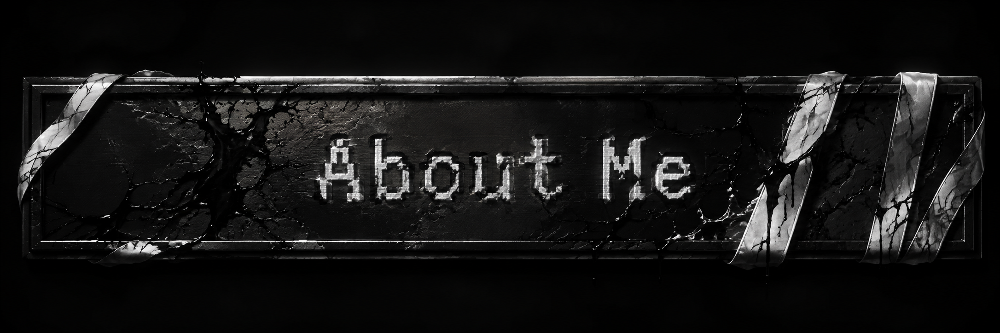
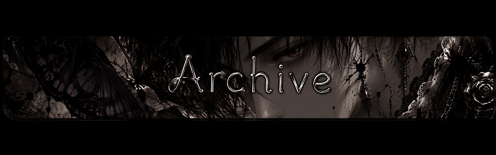

  

 

 

<table width="100%" border="0" cellpadding="0" cellspacing="0">
  <tr>
    <td width="60%" valign="top">
      
        
      
🌸 &nbsp; <b>alias</b> &middot; Light &middot; ne0k1r4 &middot; Kira

      
🗺️ &nbsp; <b>location</b> &middot; India

      
💻 &nbsp; <b>craft</b> &middot; Security Researcher &middot; CTF Player

      
🎓 &nbsp; <b>academic</b> &middot; B.Tech (1st year)

      
❄️ &nbsp; <b>environment</b> &middot; Arch Linux + Hyprland

      
☕ &nbsp; <b>routine</b> &middot; studying at 3 AM with lofi beats & tea

    </td>
    <td width="40%" align="right" valign="top">
      
    </td>
  </tr>
</table>

 

 

<table width="100%" border="0" cellpadding="0" cellspacing="0">
  <tr>
    <td width="60%" valign="top">
      
        
      <!-- BLOG_RSS_START -->

🦋 &nbsp;<a href="https://ctf5.vercel.app/posts/147/how-i-found-a-vulnerability-in-a-vibe-coded-proxy-site/" style="text-decoration: none; color: #c9a0dc; font-weight: bold;">How I Found a Vulnerability in a Vibe-Coded Proxy Site and Built a Fetcher to Exploit It</a>

🦋 &nbsp;<a href="https://ctf5.vercel.app/posts/140/dawgctf-2026-machine-learnding-reverse-engineering-writeup/" style="text-decoration: none; color: #c9a0dc; font-weight: bold;">DawgCTF 2026 - Machine Learnding - Reverse Engineering Writeup</a>

🦋 &nbsp;<a href="https://ctf5.vercel.app/posts/142/dawgctf-2026-locksmith-osint-writeup/" style="text-decoration: none; color: #c9a0dc; font-weight: bold;">DawgCTF 2026 - Locksmith - OSINT Writeup</a>

🦋 &nbsp;<a href="https://ctf5.vercel.app/posts/141/dawgctf-2026-computer-repair-iii-osint-writeup/" style="text-decoration: none; color: #c9a0dc; font-weight: bold;">DawgCTF 2026 - Computer Repair III - OSINT Writeup</a>

🦋 &nbsp;<a href="https://ctf5.vercel.app/posts/143/dawgctf-2026-owo-osint-writeup/" style="text-decoration: none; color: #c9a0dc; font-weight: bold;">DawgCTF 2026 - owo? - OSINT Writeup</a>

🦋 &nbsp;<a href="https://ctf5.vercel.app/posts/144/dawgctf-2026-the-lookouts-legend-osint-writeup/" style="text-decoration: none; color: #c9a0dc; font-weight: bold;">DawgCTF 2026 - The Lookout's Legend - OSINT Writeup</a>

🦋 &nbsp;<a href="https://ctf5.vercel.app/posts/145/dawgctf-2026-plane-spotting-pt-1-osint-writeup/" style="text-decoration: none; color: #c9a0dc; font-weight: bold;">DawgCTF 2026 - Plane Spotting Pt. 1 - OSINT Writeup</a>

🦋 &nbsp;<a href="https://ctf5.vercel.app/posts/139/dawgctf-2026-i-hate-physics-cryptography-writeup/" style="text-decoration: none; color: #c9a0dc; font-weight: bold;">DawgCTF 2026 - I Hate Physics! - Cryptography Writeup</a>

🦋 &nbsp;<a href="https://ctf5.vercel.app/posts/146/dawgctf-2026-plane-spotting-pt-3-osint-writeup/" style="text-decoration: none; color: #c9a0dc; font-weight: bold;">DawgCTF 2026 - Plane Spotting Pt. 3 - OSINT Writeup</a>

🦋 &nbsp;<a href="https://ctf5.vercel.app/posts/119/texsaw-2026-you-snoze-you-loze-osint-writeup/" style="text-decoration: none; color: #c9a0dc; font-weight: bold;">TexSAW 2026 - You Snoze You Loze - OSINT Writeup</a>

<!-- BLOG_RSS_END -->
    </td>
    <td width="40%" align="right" valign="top">
      
    </td>
  </tr>
</table>

 

 

<table width="100%" border="0" cellpadding="0" cellspacing="0">
  <tr>
    <td width="60%" valign="middle">
      
        
      

        <i>“People with evil intent can do evil things without lying. And not all liars are evil.”</i> 
        — <b>Elaina</b> &middot; <a href="mailto:neok1ra@proton.me">neok1ra@proton.me</a>
      

    </td>
    <td width="40%" align="right" valign="top">
      
    </td>
  </tr>
</table>

 

 

  

     
     
     
     
    
  

  

